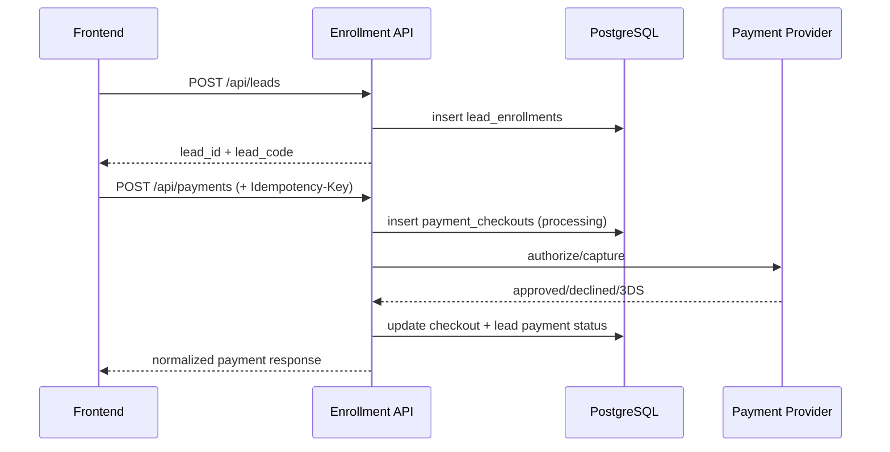
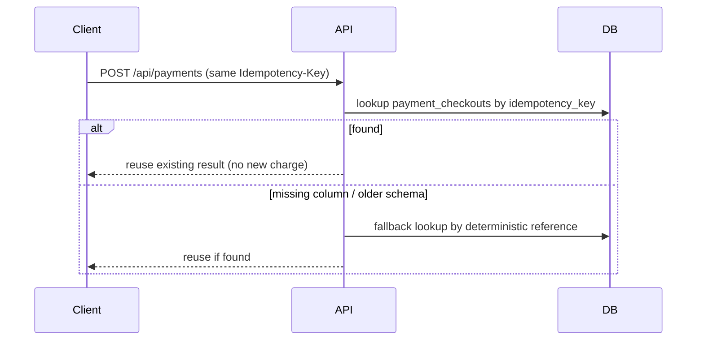
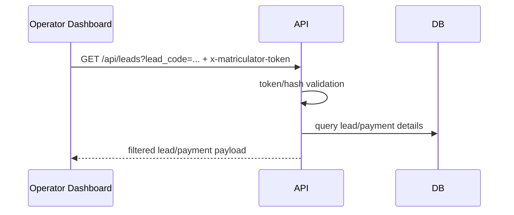

# Flow Diagrams

## 1) Enrollment + Payment

```mermaid
sequenceDiagram
  participant FE as Frontend
  participant API as Enrollment API
  participant DB as PostgreSQL
  participant PG as Payment Provider

  FE->>API: POST /api/leads
  API->>DB: insert lead_enrollments
  API-->>FE: lead_id + lead_code

  FE->>API: POST /api/payments (+ Idempotency-Key)
  API->>DB: insert payment_checkouts (processing)
  API->>PG: authorize/capture
  PG-->>API: approved/declined/3DS
  API->>DB: update checkout + lead payment status
  API-->>FE: normalized payment response
```

## 2) Retry / Idempotency

```mermaid
sequenceDiagram
  participant Client
  participant API
  participant DB

  Client->>API: POST /api/payments (same Idempotency-Key)
  API->>DB: lookup payment_checkouts by idempotency_key
  alt found
    API-->>Client: reuse existing result (no new charge)
  else missing column / older schema
    API->>DB: fallback lookup by deterministic reference
    API-->>Client: reuse if found
  end
```

## 3) Internal Operations Lookup

```mermaid
sequenceDiagram
  participant Ops as Operator Dashboard
  participant API
  participant DB

  Ops->>API: GET /api/leads?lead_code=... + x-matriculator-token
  API->>API: token/hash validation
  API->>DB: query lead/payment details
  API-->>Ops: filtered lead/payment payload
```
